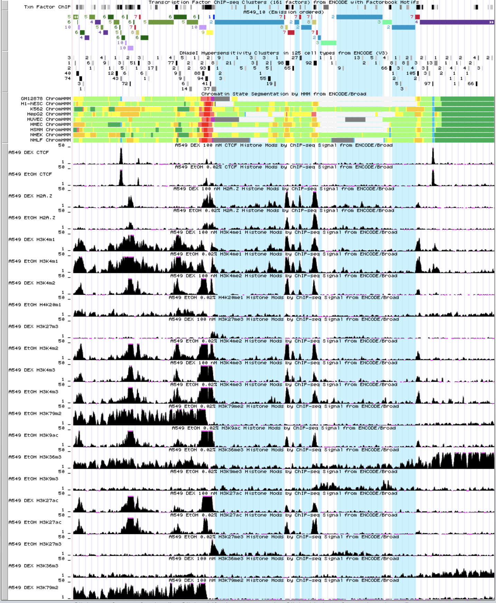
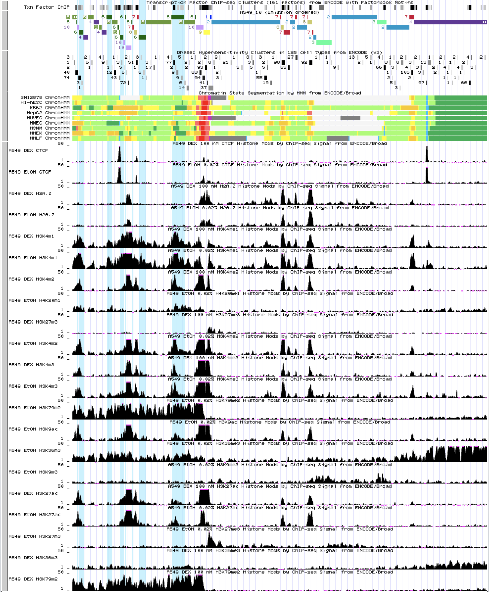

# hse_hw3_chromhmm
## Бордюгов Максим

[colab](https://colab.research.google.com/drive/11xwyp15Ofi3T6uHYlRRqOrPsO6LoJir-?usp=sharing)

| №|метка   |файл             |                                           оригинал|
|---:|:-----|:----------------|--------------------------------------------------:|
| 1|H3k27ac |bams/H3k27ac.bam | wgEncodeBroadHistoneA549H3k27acDex100nmAlnRep1.bam|
| 2|H3k27me3|bams/H3k27me3.bam|wgEncodeBroadHistoneA549H3k27me3Dex100nmAlnRep1.bam|
| 3|H3k36me3|bams/H3k36me3.bam|wgEncodeBroadHistoneA549H3k36me3Dex100nmAlnRep1.bam|
| 4|H3k04me1|bams/H3k04me1.bam|wgEncodeBroadHistoneA549H3k04me1Dex100nmAlnRep1.bam|
| 5|H3k04me2|bams/H3k04me2.bam|wgEncodeBroadHistoneA549H3k04me2Dex100nmAlnRep1.bam|
| 6|H3k04me3|bams/H3k04me3.bam|wgEncodeBroadHistoneA549H3k04me3Dex100nmAlnRep1.bam|
| 7|H3k79me2|bams/H3k79me2.bam|wgEncodeBroadHistoneA549H3k79me2Dex100nmAlnRep1.bam|
| 8|H3k09ac |bams/H3k09ac.bam |   wgEncodeBroadHistoneA549H3k09acEtoh02AlnRep1.bam|
| 9|H3k09me3|bams/H3k09me3.bam|  wgEncodeBroadHistoneA549H3k09me3Etoh02AlnRep1.bam|
|10|H4k20me1|bams/H4k20me1.bam|  wgEncodeBroadHistoneA549H4k20me1Etoh02AlnRep1.bam|
|  |Control |bams/Control.bam | wgEncodeBroadHistoneA549ControlDex100nmAlnRep1.bam|

[cellmarkfiletable.txt](res/cellmarkfiletable.txt)

```txt
A549	H3k27ac	bams/01_H3k27ac.bam	bams/Control.bam
A549	H3k27me3	bams/02_H3k27me3.bam	bams/Control.bam
A549	H3k36me3	bams/03_H3k36me3.bam	bams/Control.bam
A549	H3k04me1	bams/04_H3k04me1.bam	bams/Control.bam
A549	H3k04me2	bams/05_H3k04me2.bam	bams/Control.bam
A549	H3k04me3	bams/06_H3k04me3.bam	bams/Control.bam
A549	H3k79me2	bams/07_H3k79me2.bam	bams/Control.bam
A549	H3k09ac	bams/08_H3k09ac.bam	bams/Control.bam
A549	H3k09me3	bams/09_H3k09me3.bam	bams/Control.bam
A549	H4k20me1	bams/10_H4k20me1.bam	bams/Control.bam
```

- __Emission__  
  
- __Transition__  
  
- __Overlap__  
  
- __RefSeqTSS__  
  
- __RefSeqTES__
  

### 1 = __Heterochromatin__

### 2 = __Repressed__

### 3 = **Weak_Txn**

### 4 = **Weak_Txn**

### 5 = **Weak_Txn**

### 6 = **Weak_Enhancer**

### 7 = **Weak_Enhancer**

### 8 = **Strong_Enhancer**

### 9 = **Active_Promoter**

### 10 = **Active_Promoter**


__Вывод__: по данные графикам, можно предположить гистоновую модификацию по типу

_Пример_: `state08` выражен для следующих модификаций:
- `H2A.Z`
- `H3K4m1`
- `H3K4m2`
- `H3K4m3`
- `H3K4m1`
- `H3K9ac` _(слабо)_
- `H3K27ac`

## Бонус
[colab](https://colab.research.google.com/drive/11xwyp15Ofi3T6uHYlRRqOrPsO6LoJir-?usp=sharing)